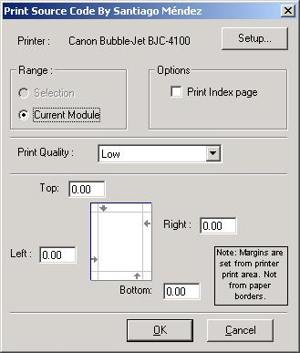



## VB Source Code Printer Add\-In \(Updated Ver\. 1\.6\)

### Description

This Add-In is usefull for every VB programmer, because It could be used each time that someone wants to print a source code contained in a form,class module or module, instead of the VB simple printing.

What this vb add-in project provides is the option to print your current module or the selected text of it, in a formatted way to facilitate reading. Optionaly you can print an index page of the sub/functions. Also you can select a printer, define some printer properties as: orientation, print quality, tray, etc., using the print setup through API.

I've not seen a VB project Add-In that prints source code in PSC before.
 
### More Info
 

             |
---                |---
**Submitted On**   |2001-06-05 08:33:26
**By**             |[Santiago A\. Méndez](https://github.com/Planet-Source-Code/PSCIndex/blob/master/ByAuthor/santiago-a-m-ndez.md)
**Level**          |Intermediate
**User Rating**    |5.0 (20 globes from 4 users)
**Compatibility**  |VB 6\.0
**Category**       |[VB function enhancement](https://github.com/Planet-Source-Code/PSCIndex/blob/master/ByCategory/vb-function-enhancement__1-25.md)
**World**          |[Visual Basic](https://github.com/Planet-Source-Code/PSCIndex/blob/master/ByWorld/visual-basic.md)
**Archive File**   |[VB Source 20626652001\.zip](https://github.com/Planet-Source-Code/santiago-a-m-ndez-vb-source-code-printer-add-in-updated-ver-1-6__1-23598/archive/master.zip)

